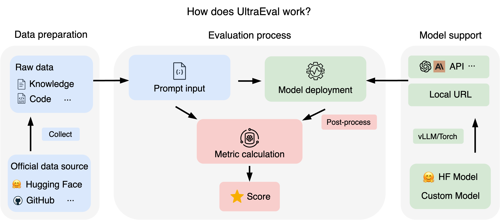

<div align="center">
  
  <br />
  <br />
<p align="center">
 <a href="https://ultraeval.openbmb.cn/home"> 🌐Website</a> •
 <a href="#总览">📖总览</a> •
 <a href="#快速开始">🔧快速开始</a> •
 <a href="https://ultraeval.openbmb.cn/home">🛠️详细教程</a> 
</p>
</div>


# 更新

- \[2023.11.17\]我们开源了UltraEval评测框架，并发布了第一版榜单。🔥🔥🔥

# 总览
UltraEval是一个开源的大模型能力评测框架，提供了一套轻量级、易于使用的评测体系，支持主流大模型的性能评估。它的主要特色如下：
- 轻量易用的评测框架：具备简洁直观的设计，依赖少，易于部署，具有良好的扩展性，适用多种评测场景。
- 灵活多样的评测方法：提供了统一的prompt模板和丰富的评估指标，同时支持自定义。
- 高效快速的部署推理：支持包括torch和vLLM在内的多种模型部署方案，并实现了多实例部署以加速评测过程。
- 公开透明的开源榜单：维护一个公开的、可追溯和可复现的评测榜单，由社区推动更新，确保透明度。
- 官方权威的评测数据：采用广泛认可的官方评测集，保证评测的公平性和标准化，确保结果具有可比性和复现性。
- 全面广泛的模型支持：支持Huggingface平台上的开源模型以及个人训练的模型。

UltraEval整体流程如下：
<div align="center">
<p align="center">

</p>
</div>

# 快速开始
欢迎体验UltraEval——您的大模型能力评测助手，只需几个简单步骤，即可启动评测：

## 1.安装UltraEval

```shell
git clone https://github.com/OpenBMB/UltraEval.git
cd UltraEval
pip install .
```
## 2.模型测评
进入UltraEval根目录，以下所有指令均在根目录下执行。

### 2.1生成评测任务文件
解压数据
```shell
unzip RawData.zip
```
对数据进行预处理
```shell
python data_process.py
```
执行下述指令显示支持的数据集及其对应任务：

```shell
python configs/show_datasets.py
```

通过以下指令指定需要测评的任务：

```shell
python configs/make_config.py \
    --datasets ALL \ #指定评测集，默认为ALL(所有的数据集)；指定多个数据集用,间隔，例如：--datasets MMLU,Ceval
    --tasks \ # 指定评测任务，默认为空。
    --method \ # 选择生成方式，默认为gen。
    --save # 选择评测文件的文件名，默认为eval_config.json。
```
注意⚠️：当tasks传入参数，datasets的数量必须为1。表示执行某个评测集下的某些任务；save是一个文件名，且以.json结尾。不需要传入路径，默认在configs下。
执行上述指令将在configs目录下生成评测文件eval_config.json，以及会下载每个任务的数据到对应的目录中。

### 2.2本地部署模型
以部署meta-llama/Llama-2-7b-hf为例，使用vllm部署模型：
```shell
python URLs/vllm_url.py \
    --model_name meta-llama/Llama-2-7b-hf \ # 模型名，使用vLLM时，model_name和hugging face官方名称保持一致
    --gpuid \ # 指定部署模型的gpu id，默认0
    --port # 部署URL的端口号，默认5002
```
关于个人训练的模型以及多GPU批量评测方式请参考[Tutorial.md]()。

### 2.3进行测评获取测评结果
创建一个bash脚本，执行main.py程序，获取测评结果：
```shell
python main.py \
    --model general \ #选择不同的模型
    --model_args url=$URL,concurrency=1 \ #指定2.2步生成的URL，初始化模型参数，以及并发线程数
    --config_path configs/eval_config.json \ #评测文件路径，指定2.1步生成的eval_config.json（默认）
    --output_base_path logs \  #测评结果保存路径
    --batch_size 10 \ # 批处理数量
    --postprocess general_torch \ # 对模型输出的结果做后处理清洗
    --params models/model_params/vllm_sample.json \ # 模型推理时的参数
    --write_out \ # 是否保存每个instance的相关数据
    # --limit 2 \ # 评测每个任务的一定数量的instance
```
测评结果保存在路径下：
```shell
output_base_path    #：输出路径
--timestamp # 时间戳
----task1   # 评测任务
--------config.json # 评测任务的相关参数配置记录
--------final_metrics.json  # 该任务的最终结果
--------instance.jsonl  # 该任务每一条样例的详细结果
----....    # 其他任务目录
----_all_results.json   # 所有评测任务结果的综合
```
### 2.4更多测评功能支持
更多测评方法和功能（自定义评测集评测、批量测评、多GPU加速）详情请见[Tutorials.md]()

# 数据集支持

UltraEval支持21个评测数据集，并按能力分类全面衡量大模型能力，数据集支持如下：

| 五大维度 | 二级       | 任务列表                                                     |
| -------- | ---------- | ------------------------------------------------------------ |
| 知识推理 | 学科知识   | MMLU, CMMLU, C-Eval |
| 数学计算 | 数学计算   | GSM8K, MATH                                                  |
| 代码生成 | 代码生成   | HumanEval, MBPP                                              |
| 逻辑推理 | 蕴含关系   | AX-B, AX-G, RTE                                             |
|          | 常识推理   | HellaSwag, COPA, PIQA |
| 语言理解 | 阅读理解   | BoolQ, C3, ChiD, LAMBADA, TyDi QA |
|          | 语义相似度 | AFQMC                                                 |
|          | 词义消歧   | WiC                    |
|          | 情感分析   | eprstmt                                                      |

# 测评榜单
请访问UltraEval[官方排行榜](https://ultraeval.openbmb.cn/rank)了解最新模型及其在每个维度中的详细结果。

# 致谢
- [HuggingFace](https://huggingface.co)
- [vLLM](https://github.com/vllm-project/vllm/blob/main)
- [Harness](https://github.com/EleutherAI/lm-evaluation-harness/tree/master)
# 联系我们
- 如果有关于 UltraEval的问题或建议或功能请求，请提交GitHub Issue，让我们共同建设更好的UltraEval。
# License
本项目遵循Apache-2.0
