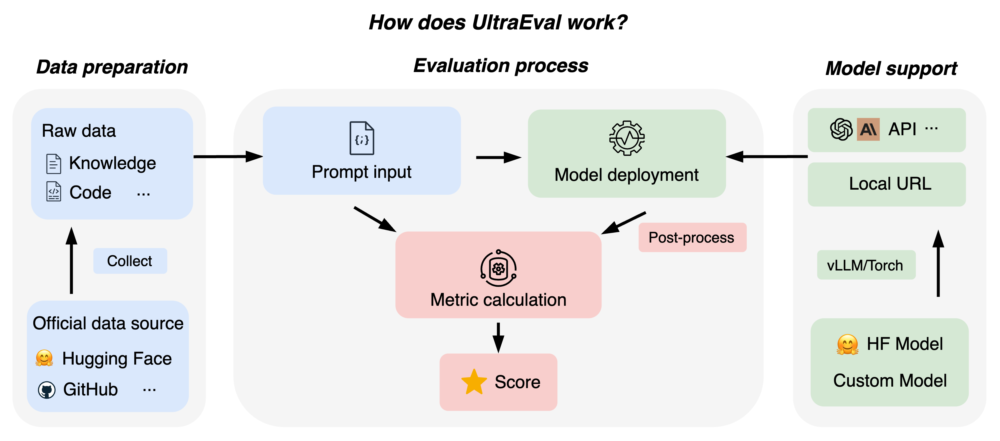

<div align="center">
  
  <br />
  <br />
<p align="center">
 <a href="https://ultraeval.openbmb.cn/home"> 🌐Website</a> •
 <a href="#Overview">📖Overview</a> •
 <a href="#Quick start">🔧Quick start</a> •
 <a href="docs/tutorials/ultraeval.md">🛠️Tutorials</a> •
 <a href="README_zh.md">中文</a> 
</p>
</div>


# News!

- \[2023.11.23\]We open sourced the UltraEval evaluation framework and published the first version of the list.🔥🔥🔥

# Overview
UltraEval is an open-source framework for evaluating the capabilities of foundation models, providing a suite of lightweight, easy-to-use evaluation systems that support the performance assessment of mainstream LLMs. Its main features are as follows:
1. **Lightweight and Easy-to-use Evaluation Framework:** Seamlessly designed with an intuitive interface, minimal dependencies, effortless deployment, excellent scalability, adaptable to diverse evaluation scenarios.

2. **Flexible and Diverse Evaluation Methods:** Supports a unified prompt template with an extensive array of evaluation metrics, allowing for personalized customization to suit specific needs.

3. **Efficient and Swift Inference Deployment:** Facilitates multiple model deployment strategies such as torch and vLLM, enabling multi-instance deployment for swift evaluation processes.

4. **Publicly Transparent Open-Source Leaderboard:** Maintains an open, traceable, and reproducible evaluation leaderboard, driven by community updates to ensure transparency and credibility.

5. **Official and Authoritative Evaluation Data:** Utilizes widely recognized official evaluation sets to ensure fairness and standardization in evaluations, ensuring results are comparable and reproducible.

6. **Comprehensive and Extensive Model Support:** Offers support for a wide spectrum of models, including those from the Huggingface open-source repository and personally trained models, ensuring comprehensive coverage.


UltraEval's overall workflow is as follows:
<div align="center">
<p align="center">

</p>
</div>

# Quick start
Welcome to UltraEval, your assistant for evaluating the capabilities of large models. Get started in just a few simple steps:

## 1. Install UltraEval

```shell
git clone https://github.com/OpenBMB/UltraEval.git
cd UltraEval
pip install .
```
## 2.Model evaluation
Enter the UltraEval root directory; all the following commands are executed in the root directory.

### 2.1 Generate the evaluation task file

Download datasets:
```shell
wget -O RawData.zip "https://cloud.tsinghua.edu.cn/f/71b5232264ae4833a4d0/?dl=1"
```
Unzip evaluation datasets:
```shell
unzip RawData.zip
```
Preprocess the data:
```shell
python data_process.py
```
Execute the following command to display the supported data sets and their corresponding tasks:

```shell
python configs/show_datasets.py
```

Specify the tasks to be tested with the following instructions:
```shell
python configs/make_config.py --datasets ALL
```
The following is the specific parameter description:
* ``datasets``: Select the data set, default is All(all data sets); Specify multiple data sets, with, spacing. For example, --datasets MMLU,Ceval
* ``tasks``: Select the task, the default value is empty.
* ``method``: Select the generation method, the default value is gen.
* ``save``: Select the filename for the generated evaluation file, which defaults to eval_config.json.

Note ⚠️ : When 'tasks' have values, the number of 'datasets' must be 1, indicating that certain tasks under a specific dataset are to be executed; 'save' is a filename that should end with .json, and there is no need to input a path as it defaults to the 'configs' directory. Executing the above command will generate an evaluation file named 'eval_config.json' in the 'configs' directory.

The "RawData.zip" contains data collected from the official website. To expedite the unzipping process, the 'Math' and 'race' data have been preprocessed (the zip file includes the code, facilitating replication by users).

### 2.2 Local deployment model
As an example, deploying meta-llama/Llama-2-7b-hf using the vLLM deployment model:
```shell
python URLs/vllm_url.py \
    --model_name meta-llama/Llama-2-7b-hf \
    --gpuid 0 \
    --port 5002
```
Below is a description of the specific parameters:
* ``model_name``: Model name, when using vLLM, model_name and hugging face official name need to be consistent.
* ``gpuid``: Specify the gpu id of the deployment model, default is 0. If more than one is needed, use , to separate them.
* ``port``: The port number of the deployment URL, default 5002.

Executing the above code will generate a URL.
For a model of individual training and a multi-GPU batch evaluation approach, see [Tutorial.md]().

### 2.3 Take the assessment and get the results
Create a bash script[optional] and execute the main.py program to get the results of the assessment:
```shell
python main.py \
    --model general \
    --model_args url=$URL,concurrency=1 \
    --config_path configs/eval_config.json \
    --output_base_path logs \
    --batch_size 1 \
    --postprocess general_torch \
    --params models/model_params/vllm_sample.json \
    --write_out
```
Below is a description of the specific parameters:
* ``model``: Specifies the model. Currently, the general, gpt-3.5-turbo, and gpt-4 models are supported.
* ``model_args``: Specify the URL generated in 2.2 and the number of concurrent threads to initialize the model parameters. Separate with commas, and connect parameter names and values with an equals sign. For example: url=$URL,concurrency=1.
* ``config_path``: Specify the evaluation file path from 2.1, which by default is configs/eval_config.json.
* ``output_base_path``: Specifies the path to save the results. The default is logs.
* ``batch_size``: Specifies the number of batches to be processed. The default is 1.
* ``num_fewshot``: Specifies the number of fewshot samples.
* ``postprocess``: Specifies the post-processing method, which defaults to general_torch.
* ``params``: Specifies parameters for model inference. The default is models/model_params/vllm_sample.json.
* ``write_out``: Whether to save the data for each instance. The default value is False.
* ``limit``: Evaluate a certain number of instances per task, default to None.

Evaluation results are saved in the path:
```shell
output_base_path    #：Output path
--timestamp # timestamp
----task1   # Evaluation task
--------config.json # Record the configuration of related parameters of the evaluation task
--------final_metrics.json  # The final result of the task
--------instance.jsonl  # Detailed results for each instance of the task
----....    # Other task directory
----_all_results.json   # Synthesis of results from all evaluation tasks
```
### 2.4 More evaluation function support
More evaluation methods and features (custom evaluation set, batch evaluation, multi-GPU acceleration) can be found in [Tutorials.md]()

# Evaluation set support

UltraEval currently supports 59 evaluation datasets and comprehensively measures large model capabilities through capability categories, as follows:

<table border="1">
  <tr>
    <th>First-level</th>
    <th>Second-level</th>
    <th>Dataset list</th>
  </tr>
  <tr>
    <td rowspan="2"><strong>Knowledge</strong></td>
    <td>Disciplinary knowledge</td>
    <td>CMMLU, MMLU, CEval, AGI-Eval, JEC-QA, MEDMCQA, MEDQA-MCMLE, MEDQA-USMLE, GAOKAO-Bench</td>
  </tr>
  <tr>
    <td>World knowledge</td>
    <td>NQ-open, TriviaQA, TruthfulQA</td>
  </tr>
  <tr>
    <td><strong>Math</strong></td>
    <td>Math</td>
    <td>GSM8K, MATH</td>
  </tr>
  <tr>
    <td><strong>Code</strong></td>
    <td>Code</td>
    <td>HumanEval, MBPP</td>
  </tr>
  <tr>
    <td rowspan="3"><strong>Logic</strong></td>
    <td>Logical reasoning</td>
    <td>BBH</td>
  </tr>
  <tr>
    <td>Implicative relation</td>
    <td>AX-B, AX-G, CB, CMNLI, OCNLI, OCNLI-FC, RTE</td>
  </tr>
  <tr>
    <td>Common sense reasoning</td>
    <td>HellaSwag, OpenBookQA, ARC-c, ARC-e, CommonsenseQA, COPA, PIQA, SIQA, WinoGrande, Story Cloze, StrategyQA, TheoremQA</td>
  </tr>
  <tr>
    <td rowspan="6"><strong>Language</strong></td>
    <td>Reading comprehension</td>
    <td>boolq, C3, ChiD, DRCD, LAMBADA, MultiRC, QuAC, RACE, RECORD, SQuAD, TyDi QA, SummEdits</td>
  </tr>
  <tr>
    <td>Translation</td>
    <td>FLORES, wmt20-en-zh, wmt20-en-zh</td>
  </tr>
  <tr>
    <td>Semantic similarity</td>
    <td>AFQMC, BUSTM</td>
  </tr>
  <tr>
    <td>Word sense disambiguation</td>
    <td>CLUEWSC, WIC, Winogender, WSC</td>
  </tr>
  <tr>
    <td>Sentiment analysis</td>
    <td>EPRSTMT</td>
  </tr>
  <tr>
    <td>News classification</td>
    <td>TNEWS</td>
  </tr>
</table>


# Leaderboard
Please visit UltraEval [Leaderboard](https://ultraeval.openbmb.cn/rank) to learn about the latest models and their detailed results in each dimension.

# Acknowledgement
- [HuggingFace](https://huggingface.co)
- [vLLM](https://github.com/vllm-project/vllm/blob/main)
- [Harness](https://github.com/EleutherAI/lm-evaluation-harness/tree/master)
- [OpenCompass](https://github.com/open-compass/opencompass)
# Contact us
If you have questions, suggestions, or feature requests regarding UltraEval, please submit GitHub Issues to jointly build an open and transparent UltraEval evaluation community.
# License
This project follows the Apache-2.0 license.
